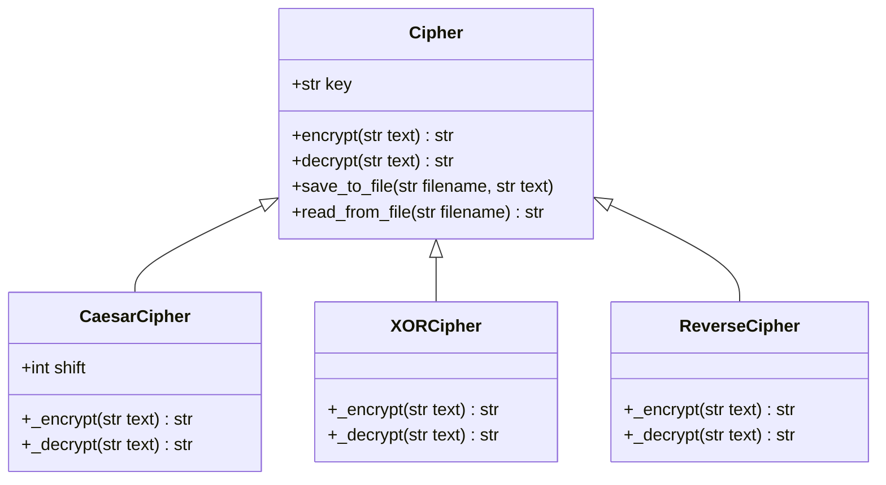

# Szyfrator wiadomości tekstowych

Projekt implementujący różne algorytmy szyfrowania tekstu w języku Python.

## Autorzy
- Adrian Rewera
- Kamil Raczyński 

## Wymagania
- Python 3.6+
- matplotlib >= 3.0 (do generowania wykresów)

## Instalacja
```bash
pip install matplotlib
```

## Uruchamianie
Główny program:
```bash
python main.py
```

Testy jednostkowe:
```bash
python -m unittest tests.py
```

Testy wydajnościowe:
```bash
python performance_test.py
```

## Dostępne szyfry
1. Szyfr Cezara - przesunięcie liter o stałą wartość
2. Szyfr XOR - operacja bitowa na znakach
3. Odwrócenie tekstu - proste odwrócenie kolejności znaków

## Przykładowe użycie
```python
from szyfrator.cipher import CaesarCipher

cipher = CaesarCipher("tajny_klucz")
zaszyfrowane = cipher.encrypt("Tajna wiadomość")
odszyfrowane = cipher.decrypt(zaszyfrowane)
```

## Struktura projektu
```
Projekt_Szyfrator/
├── init.py
├── cipher.py        # Implementacja szyfrów
├── main.py 
├── exceptions.py    # Wyjątki
├── tests.py         # Testy jednostkowe
└── performance_test.py # Testy wydajnościowe
```

## Diagram klas


## Przykładowe dane wejściowe/wyjściowe
Wejście:
```
Tekst: "Ala ma kota"
Klucz: "tajne"
```

Wyjście dla szyfru Cezara:
```
Zaszyfrowane: "Gqg qg ouzg"
Odszyfrowane: "Ala ma kota"
```
